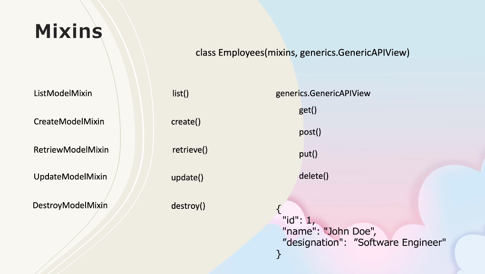
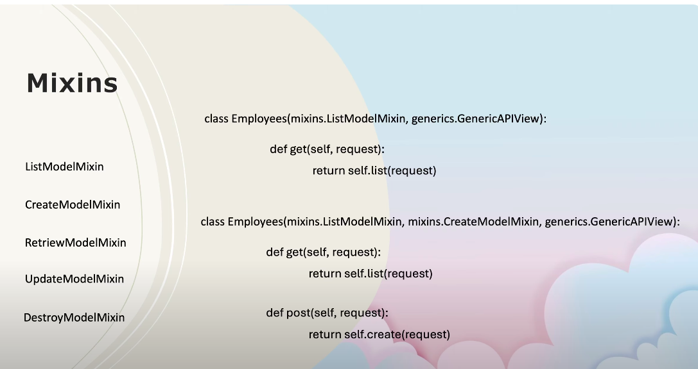

# REST API Django Project

## Overview
This project was built using Django and Django REST Framework (DRF) to create a RESTful API. The project includes models, serializers, views, and endpoints to perform CRUD operations on resources like students and employees.

---

## What I Learned

### 1. **Django Models**
- Learned how to define models to represent database tables.
- Created models like `Student` and `Employee` with fields such as `ID`, `Name`, and `department`.

### 2. **Function-Based Views**
- Implemented function-based views to handle API requests.
- Used `@api_view` decorators to define GET, POST, PUT, and DELETE methods for endpoints.

### 3. **Class-Based Views**
- Explored class-based views like `APIView` for better structure and reusability.
- Learned how to override methods like `get`, `post`, `put`, and `delete` for specific functionality.

### 4. **Serialization**
- Understood the concept of serialization and deserialization.
- Used `ModelSerializer` for automatic serialization of Django models.
- Learned how to manually serialize data using `JsonResponse` and `safe=False`.

### 5. **Django REST Framework**
- Learned how to use DRF to simplify API development.
- Used tools like `Response`, `status`, and `serializers` to handle API responses and data validation.

### 6. **Error Handling**
- Implemented error handling for cases like missing objects (`Http404`) and invalid data.
- Used DRF's built-in status codes for consistent API responses.

### 7. **Database Migrations**
- Learned how to create and apply migrations to update the database schema.
- Debugged issues like missing tables and ensured proper migration workflows.

### 8. **URL Routing**
- Configured URL patterns using `path` and `include` to organize API endpoints.
- Learned how to structure URLs for versioning (e.g., `/api/v1/`).

### 9. **Testing API Endpoints**
- Tested API endpoints using tools like Postman or curl.
- Verified CRUD operations and ensured proper responses for different scenarios.

### 10. **Mixins**
- Mixins are reusable code classes in object oriented programming  tht provide specific functionalities   

---

## Key Features
- **Students API**: Manage student records with endpoints for listing, creating, updating, and deleting students.
- **Employees API**: Manage employee records with similar CRUD functionality.
- **Error Handling**: Proper error responses for invalid requests or missing resources.

---

## Tools and Technologies
- **Django**: Backend framework for building the application.
- **Django REST Framework**: For creating RESTful APIs.
- **SQLite**: Database used for development.
- **Postman**: For testing API endpoints.

---

## Challenges Faced
- Debugging circular imports in views and serializers.
- Resolving database migration issues like missing tables.
- Structuring class-based views for better reusability.

---

## Conclusion
This project helped me understand the fundamentals of building RESTful APIs using Django and DRF. I gained hands-on experience with models, serializers, views, and error handling, which are essential for backend development.