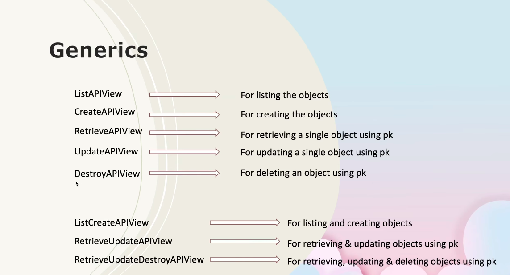
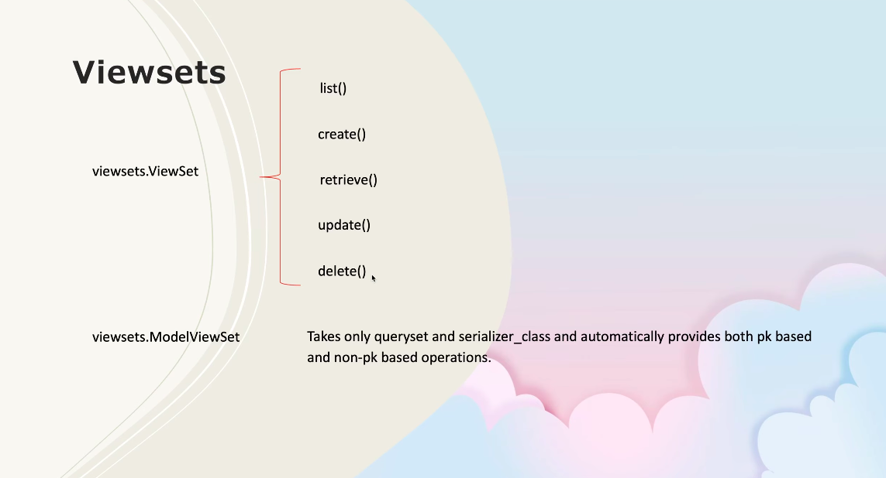
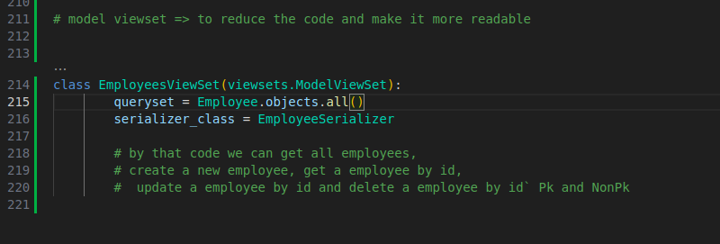

# REST API Django Project

## Overview
This project was built using Django and Django REST Framework (DRF) to create a RESTful API. The project includes models, serializers, views, and endpoints to perform CRUD operations on resources like students and employees.

---

## What I Learned

### 1. **Django Models**
- Learned how to define models to represent database tables.
- Created models like `Student` and `Employee` with fields such as `ID`, `Name`, and `department`.

### 2. **Function-Based Views**
- Implemented function-based views to handle API requests.
- Used `@api_view` decorators to define GET, POST, PUT, and DELETE methods for endpoints.

### 3. **Class-Based Views**
- Explored class-based views like `APIView` for better structure and reusability.
- Learned how to override methods like `get`, `post`, `put`, and `delete` for specific functionality.

### 4. **Serialization**
- Understood the concept of serialization and deserialization.
- Used `ModelSerializer` for automatic serialization of Django models.
- Learned how to manually serialize data using `JsonResponse` and `safe=False`.

### 5. **Django REST Framework**
- Learned how to use DRF to simplify API development.
- Used tools like `Response`, `status`, and `serializers` to handle API responses and data validation.

### 6. **Error Handling**
- Implemented error handling for cases like missing objects (`Http404`) and invalid data.
- Used DRF's built-in status codes for consistent API responses.

### 7. **Database Migrations**
- Learned how to create and apply migrations to update the database schema.
- Debugged issues like missing tables and ensured proper migration workflows.

### 8. **URL Routing**
- Configured URL patterns using `path` and `include` to organize API endpoints.
- Learned how to structure URLs for versioning (e.g., `/api/v1/`).

### 9. **Testing API Endpoints**
- Tested API endpoints using tools like Postman or curl.
- Verified CRUD operations and ensured proper responses for different scenarios.

### 10. **Mixins**
- Mixins are reusable code classes in object oriented programming  tht provide specific functionalities 

- Mixins in Django REST Framework are reusable classes that provide specific functionality for handling common API operations. They are designed to be used with GenericAPIView or its subclasses to simplify the implementation of class-based views. By combining mixins, you can create views that handle multiple operations (e.g., list, create, retrieve, update, delete) without writing redundant code.

- Code Reusability: Mixins encapsulate common functionality, reducing the need to write repetitive code.
- Simplicity: By combining mixins, you can quickly implement CRUD operations without manually handling database queries or serialization.
Consistency: Mixins follow DRF's conventions, ensuring consistent behavior across views.

- The Employees class uses ListModelMixin and CreateModelMixin to handle listing and creating employees.

- The EmployeeDetail class uses RetrieveModelMixin, UpdateModelMixin, and DestroyModelMixin to handle retrieving, updating, and deleting a specific employee.

### 11. **Generic Views in DRF**
- In Django REST Framework (DRF), generics refer to a set of pre-built, class-based views that provide common functionality for handling API operations. These generic views are built on top of GenericAPIView and DRF mixins, combining them to simplify the implementation of RESTful APIs. They allow developers to quickly create views for common use cases like listing, creating, retrieving, updating, and deleting objects, without writing repetitive code.

- Key Features of Generics
- 1. Predefined Behavior: Generics come with built-in methods for handling common HTTP methods (GET, POST, PUT, DELETE).
- 2. Customizable: You can override methods or add additional logic to tailor the behavior to your needs.
- 3. Efficient: They reduce boilerplate code by combining serializers, querysets, and mixins into a single class.

### 12. **ViewSets in Django REST Framework (DRF)**
- ViewSets in Django REST Framework are a higher-level abstraction that combine the logic for handling multiple HTTP methods (GET, POST, PUT, DELETE, etc.) into a single class. They simplify the implementation of RESTful APIs by grouping related views into one class, reducing boilerplate code and improving maintainability.

- Key Features of ViewSets
- 1. Unified Logic: Instead of creating separate views for listing, retrieving, creating, updating, and deleting objects, ViewSets combine all these operations into a single class.
- 2. Router Integration: ViewSets work seamlessly with DRF's routers, which automatically generate URL patterns for the ViewSet's actions.
- 3. Customizable: You can define custom actions or override default methods to tailor the behavior of the ViewSet.
- Types of ViewSets
- 1. ViewSet:
   - The base class for all ViewSets.
   -  Requires you to define methods like list, retrieve, create, update, and destroy.
- 2. ModelViewSet:
   -  A specialized ViewSet that provides default implementations for common actions (list, retrieve, create, update, destroy).
- 3. ReadOnlyModelViewSet:
    - A ViewSet that only provides list and retrieve actions (read-only operations).

 
### 13. **ModelViewSet in Django REST Framework (DRF)**

- A ModelViewSet is a specialized type of ViewSet in Django REST Framework that provides default implementations for common actions such as list, retrieve, create, update, and destroy. It is designed to work seamlessly with Django models and serializers, making it an efficient and concise way to build RESTful APIs.

- Key Features of ModelViewSet
- 1. Default CRUD Operations:

- Automatically provides implementations for:
    - list: Retrieve all objects.
    - retrieve: Retrieve a single object by its primary key.
    - create: Create a new object.
    - update: Update an existing object.
    - destroy: Delete an object.

- 2. Integration with Routers:

    - Works seamlessly with DRF's routers, which automatically generate URL patterns for the actions provided by the ModelViewSet.
Customizable:

    - We can override the default methods or add custom actions to tailor the behavior of the ModelViewSet

---

## Key Features
- **Students API**: Manage student records with endpoints for listing, creating, updating, and deleting students.
- **Employees API**: Manage employee records with similar CRUD functionality.
- **Error Handling**: Proper error responses for invalid requests or missing resources.

---

## Tools and Technologies
- **Django**: Backend framework for building the application.
- **Django REST Framework**: For creating RESTful APIs.
- **SQLite**: Database used for development.
- **Postman**: For testing API endpoints.

---

## Challenges Faced
- Debugging circular imports in views and serializers.
- Resolving database migration issues like missing tables.
- Structuring class-based views for better reusability.

---

## Conclusion
This project helped me understand the fundamentals of building RESTful APIs using Django and DRF. I gained hands-on experience with models, serializers, views, and error handling, which are essential for backend development.